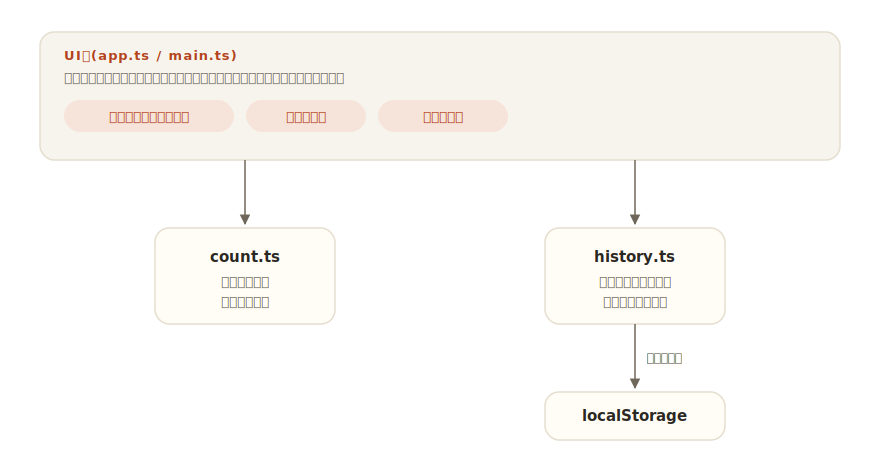

# genkou

[](https://github.com/miruky/genkou/actions/workflows/ci.yml)
[](https://github.com/miruky/genkou/actions/workflows/deploy.yml)

[](LICENSE)

**縦書きで書ける原稿用紙エディタ。字数と原稿用紙換算を数え、推敲の節目を履歴に残すアプリ。**

公開ページ: https://miruky.github.io/genkou/

## 概要

genkouは原稿を書くためだけの簡素なエディタである。本文は明朝体の縦書き(横書きにも切り替え可能)で、罫線を引いた紙の上に書く。書いている間は字数・行数・20×20の原稿用紙換算・400字詰め換算が常に頭上に表示される。大きく書き換える前に「節目を残す」を押すとその時点の本文が履歴に残り、いまの本文との差分量を見ながら、いつでも節目の状態に戻せる。

本文と履歴はブラウザのlocalStorageに保存され、サーバーには何も送らない。

### なぜ作ったのか

文章を練るとき、汎用エディタには2つの不満があった。ひとつは字数で、エッセイや応募原稿は「原稿用紙何枚」で指定されるのに、その換算を毎回電卓でやることになる。もうひとつは「思い切って削る勇気」で、書き直して悪くなったとき戻れる保証がないと、結局削れない。縦書きの紙・常時表示の字数・気軽に残せる節目という3点だけを備えた道具にした。

## アーキテクチャ



UI層はフレームワークなしのTypeScriptで、本文の入力では字数表示だけを差し替え、節目の操作のときだけ画面全体を描き直す。日本語入力(IME)の変換中に再描画が走るとキャレットや変換が途切れるため、本文のtextareaは入力中に再生成しない。字数計算と履歴の差分はDOMに依存しない純粋なモジュールで、そのまま単体テストできる。

## 技術スタック

| カテゴリ             | 技術                           |
| :------------------- | :----------------------------- |
| 言語                 | TypeScript 5(strict)           |
| ビルド               | Vite 6                         |
| テスト               | Vitest                         |
| リンタ・フォーマッタ | ESLint 9 / Prettier            |
| CI / 配信            | GitHub Actions / GitHub Pages  |
| 永続化               | localStorage(外部サービスなし) |

## 使い方

### 字数の数え方

| 表示          | 数え方                                               |
| :------------ | :--------------------------------------------------- |
| 字数          | 空白・改行を除いた文字数。句読点・記号は1字          |
| 行数          | 改行区切りの行数(空行も数える)                       |
| 文数          | 句点・終止符(。．.!?!?)で区切った文の数。連続する記号は1区切り |
| 20×20原稿用紙 | 改行で行を改め、1行20マス・1枚20行で置いたときの枚数 |
| 400字換算     | 字数を400で割った切り上げ                            |
| 読了時間      | 字数を毎分500字とみなした黙読のおおよその所要時間    |

サロゲートペア(「𠮷」のような文字)も1字として数える。

### 推敲の節目

「節目を残す」でその時点の本文が履歴に入る(覚え書きを付けられる。上限50件で古いものから消える)。各節目には、いまの本文との差分量が「+加筆 / -削除」で表示される。「この節目に戻す」は二度押しで確定し、戻す直前の本文は「戻す前の本文」として自動で節目に残るので、戻して後悔してもさらに戻れる。

### 縦書きについて

縦書きはCSSの `writing-mode: vertical-rl` によるもので、列の罫線は背景のグラデーションで引いている。マス目への文字の整列までは行わない(プロポーショナルな約物の詰めを優先)。

### 集中モードとショートカット

ツールバーの「集中モード」は字数表示も履歴も隠し、本文の紙だけを広げる。`Esc` か画面右上のボタンで戻る。`Ctrl`(Macは`Cmd`)+`S` はブラウザの保存ダイアログを抑えて本文をテキストとして書き出す。

### 配色テーマ

ヘッダ右のテーマボタンは「自動(OS設定に追従)・ライト・ダーク」を順に切り替え、選択は次回も保たれる。初回描画より前にテーマを解決するため、再読み込みでも明暗のちらつきは出ない。

### 制約

- 原稿は1本だけ持てる。複数の原稿を切り替える機能はない。
- 差分量は共通の前置きと結びを除いた残りの字数で、移動や入れ替えの検出はしない。
- データは端末のブラウザに保存されるため、端末をまたいだ同期はできない。長い原稿は「テキストを保存」で手元にも残すこと。

## プロジェクト構成

- `index.html` — エントリポイント
- `src/main.ts` — 起動。ストアの初期化
- `src/app.ts` — 画面の描画とイベント処理
- `src/icons.ts` — 線画SVGアイコン
- `src/style.css` — 原稿用紙のスタイル(縦書き・罫線・ライト・ダーク対応)
- `src/lib/count.ts` — 字数・行数・原稿用紙換算
- `src/lib/history.ts` — 節目の型・差分量・永続化
- `src/lib/theme.ts` — 配色テーマ(自動/ライト/ダーク)の解決と保存
- `docs/architecture.svg` — 構成図
- `.github/workflows/` — CI(lint・テスト・ビルド)とPagesデプロイ

## はじめ方

### 前提条件

- Node.js 22以上

### セットアップ

```bash
git clone https://github.com/miruky/genkou.git
cd genkou
npm install
npm run dev
```

### テストの実行

```bash
npm test
```

### Lintの実行

```bash
npm run lint
```

### ビルド

```bash
npm run build
```

GitHub Pagesではリポジトリ名のサブパスで配信されるため、デプロイ時は環境変数 `GENKOU_BASE=/genkou/` でViteの `base` を切り替える(`.github/workflows/deploy.yml` 参照)。

## 設計方針

- **書く道具は書くことだけに絞る** — 装飾・見出し・マークアップの機能を持たない。原稿に必要なのは本文と字数と、戻れる安心だけだと割り切った。
- **IMEを邪魔しない描画** — 本文の入力では画面を描き直さず、字数表示だけを更新する。日本語入力の変換確定が崩れるエディタは道具として失格になるため、ここだけは構造で保証した。
- **「戻す」を怖くしない** — 復元は二度押しで確定し、戻す直前の本文も自動で節目に残る。履歴があることで、削る推敲を心理的に可能にする。
- **数え方を仕様として固定する** — 空白・改行・サロゲートペアの扱いと原稿用紙換算の規則をテストで固定し、字数が環境によってぶれないようにした。

## ライセンス

[MIT](LICENSE)
